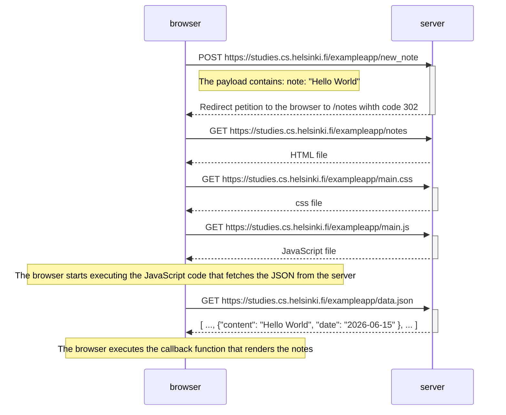

```mermaid
  sequenceDiagram

	participant browser
    participant server

    browser->>server: POST https://studies.cs.helsinki.fi/exampleapp/new_note
    activate server
	Note right of browser: The payload contains: note: "Hello World"
    server-->>browser: Redirect petition to the browser to /notes wihth code 302
    deactivate server

	browser->>server: GET https://studies.cs.helsinki.fi/exampleapp/notes
	activate server
	server-->>browser: HTML file

    browser->>server: GET https://studies.cs.helsinki.fi/exampleapp/main.css
    activate server
    server-->>browser: css file
    deactivate server

    browser->>server: GET https://studies.cs.helsinki.fi/exampleapp/main.js
    activate server
    server-->>browser: JavaScript file
    deactivate server

    Note over browser: The browser starts executing the JavaScript code that fetches the JSON from the server

    browser->>server: GET https://studies.cs.helsinki.fi/exampleapp/data.json
    activate server
    server-->>browser: [ ..., {"content": "Hello World", "date": "2026-06-15" }, ... ]
    deactivate server

    Note over browser: The browser executes the callback function that renders the notes
```
