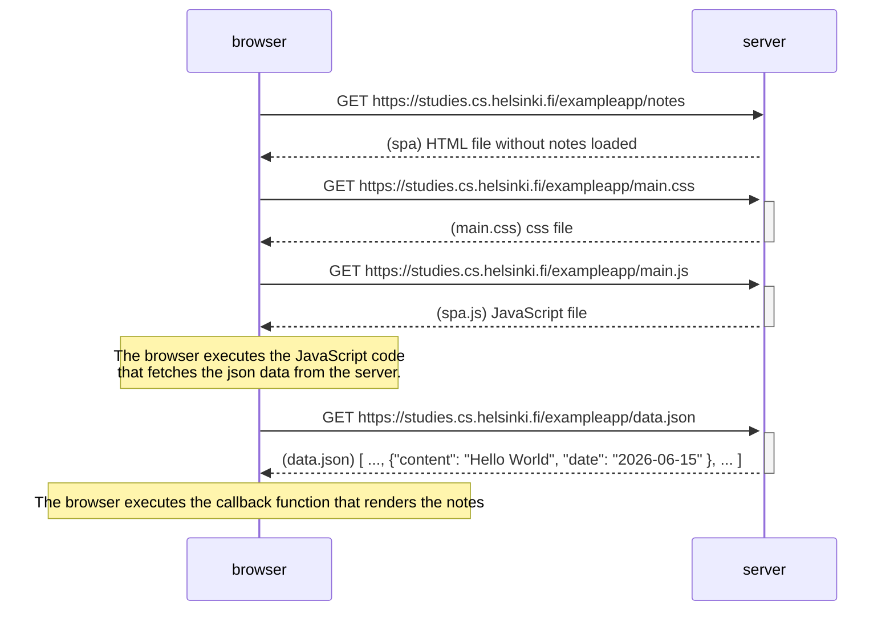

```mermaid
  sequenceDiagram

	participant browser
    participant server

  	browser->>server: GET https://studies.cs.helsinki.fi/exampleapp/notes
	activate server
	server-->>browser: (spa) HTML file without notes loaded 

    browser->>server: GET https://studies.cs.helsinki.fi/exampleapp/main.css
    activate server
    server-->>browser: (main.css) css file
    deactivate server

    browser->>server: GET https://studies.cs.helsinki.fi/exampleapp/main.js
    activate server
    server-->>browser: (spa.js) JavaScript file 
    deactivate server

    Note over browser: The browser executes the JavaScript code <br/>that fetches the json data from the server.

    browser->>server: GET https://studies.cs.helsinki.fi/exampleapp/data.json
    activate server
    server-->>browser: (data.json) [ ..., {"content": "Hello World", "date": "2026-06-15" }, ... ]
    deactivate server

    Note over browser: The browser executes the callback function that renders the notes
```
