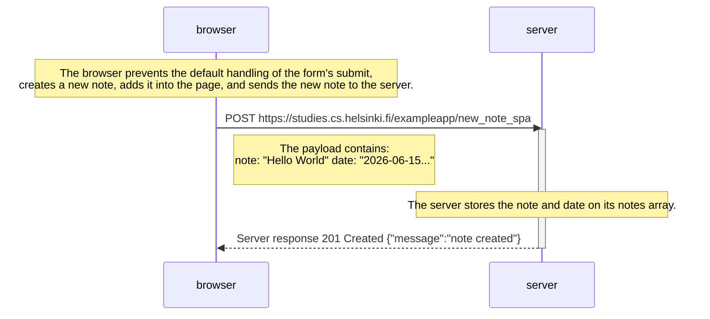

```mermaid
  sequenceDiagram

	participant browser
    participant server

	note over browser: The browser prevents the default handling of the form's submit,<br> creates a new note, adds it into the page, and sends the new note to the server.
  	browser->>server: POST https://studies.cs.helsinki.fi/exampleapp/new_note_spa
	activate server
	Note right of browser: The payload contains: <br> note: "Hello World" date: "2026-06-15..." <br>
	Note over server: The server stores the note and date on its notes array.
    server-->>browser: Server response 201 Created {"message":"note created"}
	deactivate server

```
